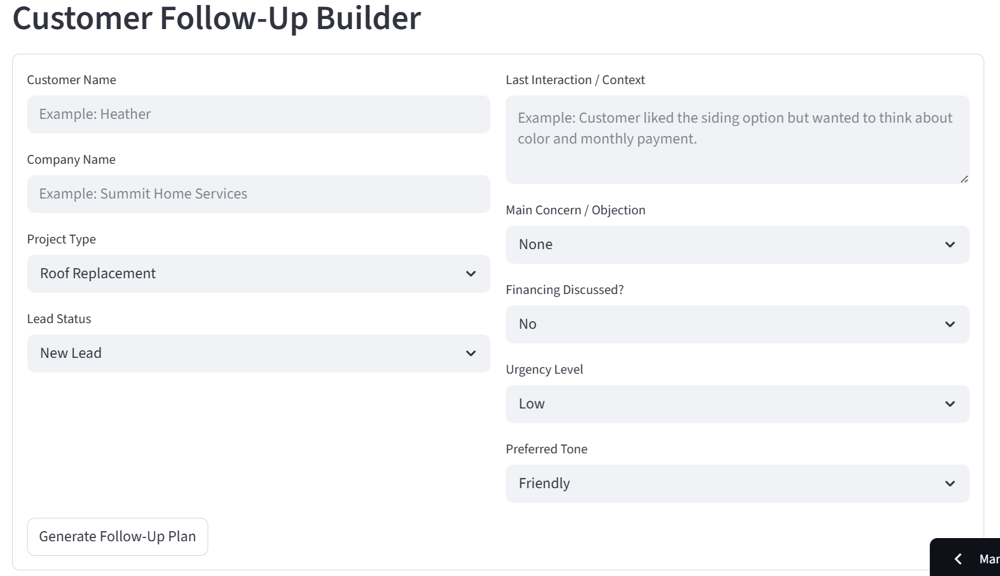
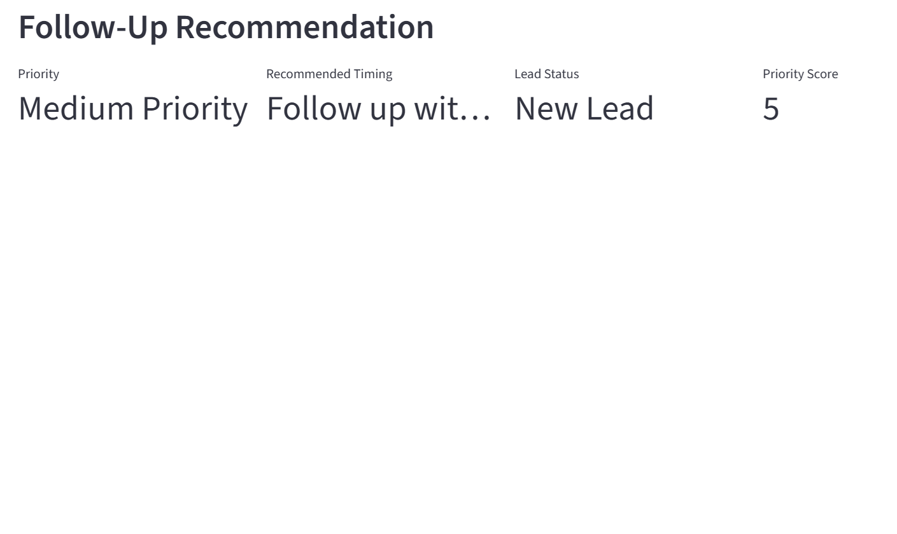
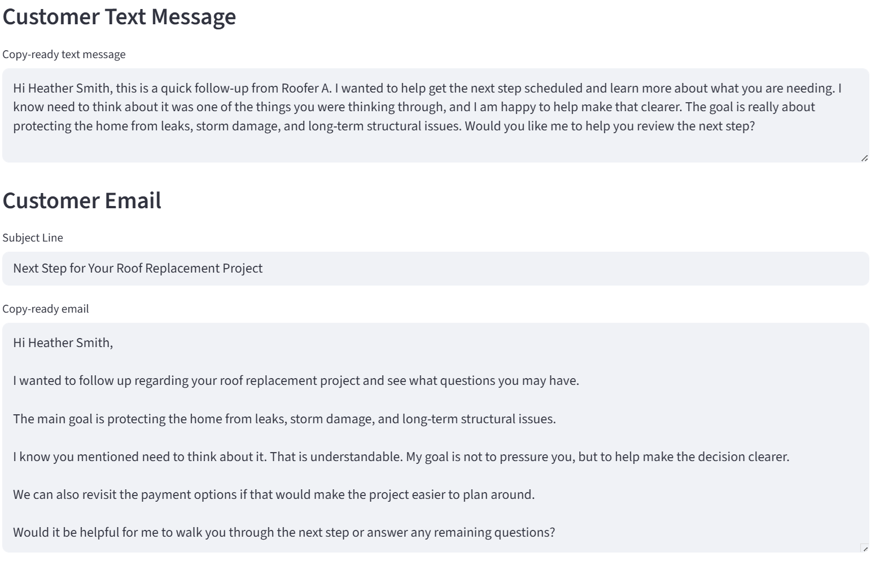
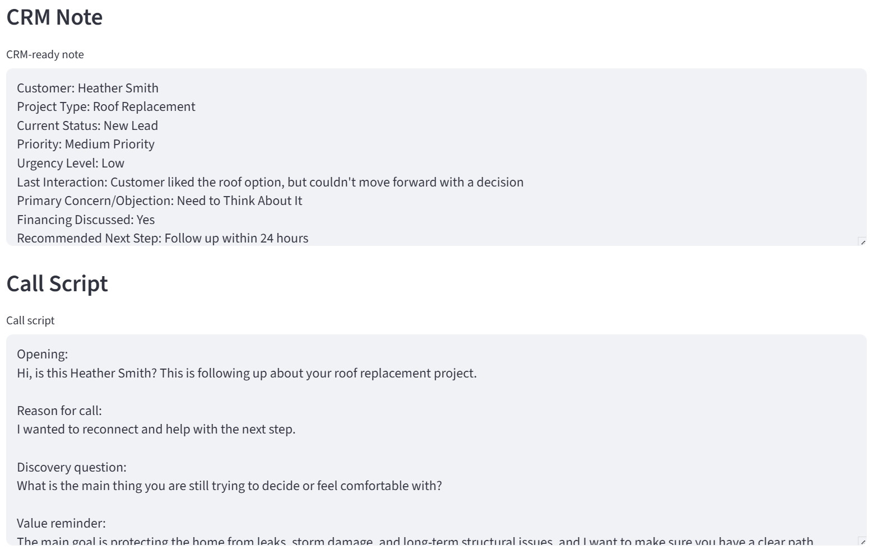
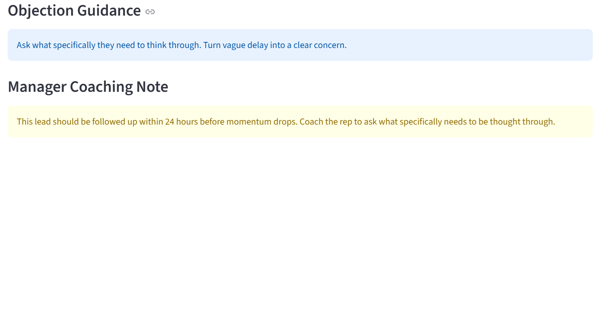
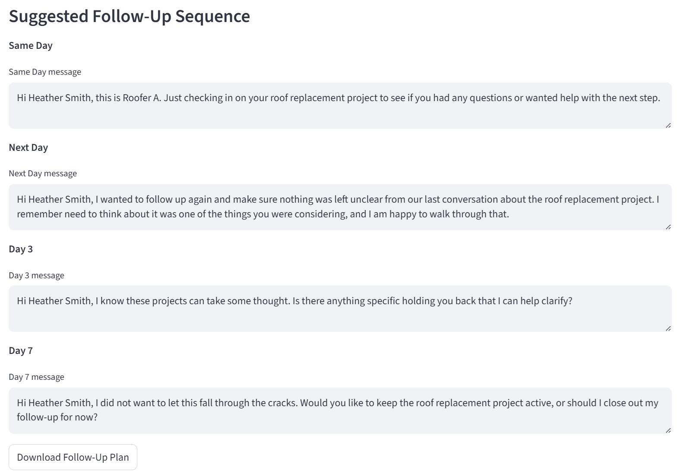

# FollowUpPilot AI

FollowUpPilot AI is an AI-assisted follow-up workflow tool for field-sales and home-service teams.

It helps sales representatives and managers turn customer context into:

- Customer follow-up text messages
- Customer follow-up emails
- CRM-ready notes
- Call scripts
- Objection-handling guidance
- Manager coaching notes
- Follow-up priority recommendations
- Multi-touch follow-up sequences
- Downloadable follow-up plans

## Live Demo 

[Launch FollowUpPilot AI](https://followuppilot-ai.streamlit.app/)

## Why this project exists

Small and mid-sized home-service businesses often lose revenue because follow-up is inconsistent, CRM notes are incomplete, and reps do not always know the best next step after a customer interaction.

FollowUpPilot AI helps standardize the follow-up process and gives teams a faster way to create clear, professional, and context-aware communication.

## Who this helps

FollowUpPilot AI is designed for home-service companies, field-sales teams, sales representatives, sales managers, small business owners, and revenue operations teams.

## What it does

The app allows users to enter customer and project context, then generates:

- Follow-up priority level
- Priority score
- Recommended follow-up timing
- Copy-ready text message
- Copy-ready email
- CRM note
- Call script
- Objection guidance
- Manager coaching note
- Suggested follow-up sequence
- Downloadable Markdown follow-up plan

## Screenshots

### Customer Follow-Up Builder



### Follow-Up Recommendation



### Text and Email Output



### CRM Note and Call Script



### Objection Guidance and Manager Coaching



### Follow-Up Sequence



### Downloadable Follow-Up Plan


## Tech Stack

- Python
- Streamlit
- Rules-based AI-style workflow logic
- Markdown report export

## Portfolio Purpose

This project was built as part of Bradley Hankins' AI operations and workflow automation portfolio.

FollowUpPilot AI demonstrates how practical AI-assisted tools can help small and mid-sized businesses improve sales follow-up consistency, CRM discipline, customer communication, objection handling, manager coaching, and revenue operations workflows.

## Run Locally

```bash
py -m pip install -r requirements.txt
py -m streamlit run app.py
```

## Built By

Bradley Hankins  
Operations & Revenue Leader | Technology & AI Workflow Integration

## Case Study

### Problem

Field-sales and home-service teams often lose opportunities because follow-up is inconsistent, CRM notes are incomplete, and sales representatives do not always have a clear next step after a customer interaction.

Common issues include:

- Slow follow-up after estimates or proposals
- Inconsistent text and email quality
- Weak CRM documentation
- Missed objection-handling opportunities
- Lack of manager visibility into next-step discipline
- Reps relying on memory instead of a repeatable process

### Solution

FollowUpPilot AI was built as a lightweight AI-assisted workflow tool that helps sales representatives and managers create stronger follow-up communication and cleaner CRM documentation.

The app allows users to enter basic customer and project context, then generates:

- Follow-up priority level
- Recommended follow-up timing
- Customer text message
- Customer email
- CRM-ready note
- Call script
- Objection guidance
- Manager coaching note
- Multi-touch follow-up sequence
- Downloadable follow-up plan

### My Role

I designed and built this project from concept to deployment, including:

- Defining the business workflow problem
- Mapping the sales follow-up process
- Designing the input structure
- Building the Streamlit app
- Writing the rules-based AI-style generation logic
- Creating downloadable Markdown reports
- Preparing fictional sample scenarios for public portfolio use
- Publishing the project on GitHub
- Deploying the live demo

### Business Value

FollowUpPilot AI helps small and mid-sized businesses improve sales execution by creating a more consistent follow-up process.

The tool can help teams:

- Respond faster after customer interactions
- Improve text and email quality
- Standardize CRM notes
- Coach reps on objections
- Reduce missed follow-up opportunities
- Create a repeatable customer communication workflow
- Turn sales context into action-ready communication

### Future Improvements

Planned future improvements include:

- OpenAI API integration for dynamic message generation
- CRM export templates
- Follow-up sequence scheduling
- Saved customer profiles
- Team-level follow-up reporting
- Rep performance tracking
- Integration with lead status CSV uploads
- PDF follow-up plan downloads