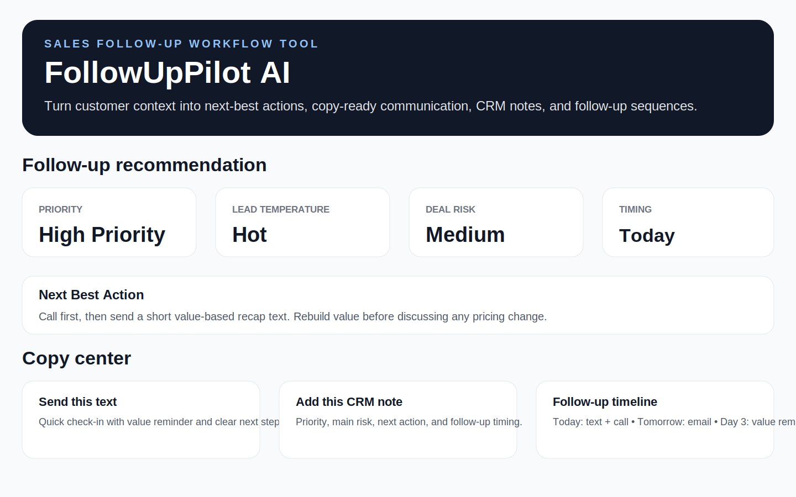

# FollowUpPilot AI

FollowUpPilot AI is an AI-enhanced sales follow-up workflow assistant for field-sales and home-service teams. It turns customer context into next-best actions, priority scoring, lead temperature, deal risk, text messages, emails, voicemail scripts, CRM notes, call scripts, objection guidance, manager coaching notes, and multi-touch follow-up sequences.

## Live Demo

[Launch FollowUpPilot AI](https://followuppilot-ai.streamlit.app/)

## Current Version: v2.4

FollowUpPilot AI combines a rules-based follow-up workflow engine with embedded AI-enhanced communication generation.

The app is designed to work in two layers:

1. **Rules-based core:** calculates priority, lead temperature, deal risk, next-best action, objection guidance, CRM notes, and follow-up sequences.
2. **Embedded AI layer:** when an OpenAI token is available, the app quietly improves the Copy Center outputs, including text, email, voicemail, CRM note, and manager coaching note.

If the AI call fails or an API key is unavailable, the app silently falls back to the rules-based communication outputs. The user experience stays the same.

## Why this project exists

Small and mid-sized businesses often lose revenue because follow-up is inconsistent, CRM notes are incomplete, and reps do not always know the best next step after a customer interaction.

FollowUpPilot AI helps standardize the follow-up process and gives teams a faster way to create clear, professional, context-aware communication and documentation.

## What it analyzes

- Customer/project context
- Project type
- Lead status
- Main concern or objection
- Urgency level
- Financing discussion status
- Preferred communication tone
- Days since last contact
- Follow-up intensity
- Preferred communication channel
- Sales follow-up timing
- Manager coaching priority

## Workflow Outputs

- Follow-up priority level
- Priority score
- Lead temperature
- Deal risk
- Main risk
- Recommended follow-up timing
- Next best action
- AI-enhanced text message with rules-based fallback
- AI-enhanced email with rules-based fallback
- AI-enhanced voicemail script with rules-based fallback
- AI-enhanced CRM note with rules-based fallback
- AI-enhanced manager coaching note with rules-based fallback
- Call script
- Objection-handling guidance
- Follow-up timeline
- Downloadable follow-up plan

## Export Strategy

Current export:

- Markdown follow-up plan (`.md`) for GitHub-friendly and developer-friendly documentation

Planned next upgrade:

- PDF follow-up plan for a more user-friendly sales manager or rep deliverable

The markdown export is useful for transparency and version control, but PDF is the better format for non-technical users.

## Suggested Test Flow

1. Launch the live demo.
2. Load the “Price Objection” sample scenario.
3. Generate the follow-up plan.
4. Review the follow-up priority, lead temperature, deal risk, and next best action.
5. Review the AI-enhanced Copy Center and follow-up timeline.
6. Review the objection guidance, manager coaching note, and follow-up sequence.
7. Download the follow-up plan.

## Screenshots

### Recommendation, Copy Center, and Timeline



## Tech Stack

- Python
- Streamlit
- OpenAI API integration
- Rules-based follow-up workflow logic
- Silent AI fallback pattern
- Markdown report export
- GitHub
- Streamlit Community Cloud

## Run Locally

```bash
py -m pip install -r requirements.txt
py -m streamlit run app.py
```

## Environment Variables

To enable embedded AI output:

```bash
OPENAI_TOKEN=your_api_key_here
```

The app still works without this token by using the rules-based fallback.

## Public Demo Note

All sample data, names, companies, and scenarios used in this project are fictional and created for public portfolio demonstration purposes.

## Case Study

### Problem

Field-sales and home-service teams often lose opportunities because follow-up is inconsistent, CRM notes are incomplete, and sales representatives do not always have a clear next step after a customer interaction.

### Solution

FollowUpPilot AI helps sales representatives and managers create stronger follow-up communication and cleaner CRM documentation. The embedded AI layer improves the Copy Center language when available while preserving a reliable rules-based fallback.

### Business Value

FollowUpPilot AI helps small and mid-sized businesses improve sales execution by creating a more consistent follow-up process, improving message quality, standardizing CRM notes, and reducing missed follow-up opportunities.

## Built By

Bradley Hankins  
Operations & Revenue Leader | AI Workflow Automation | RevOps & Process Improvement
