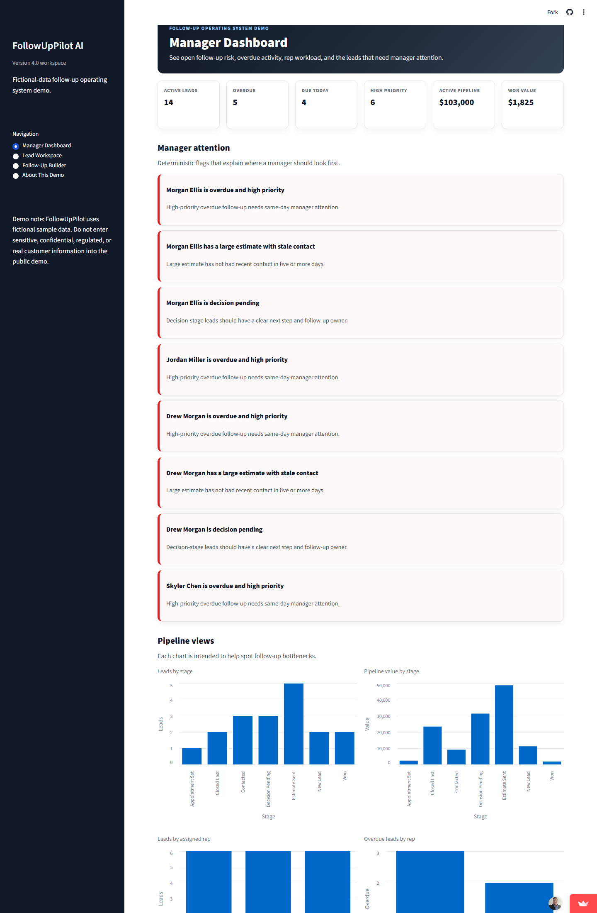
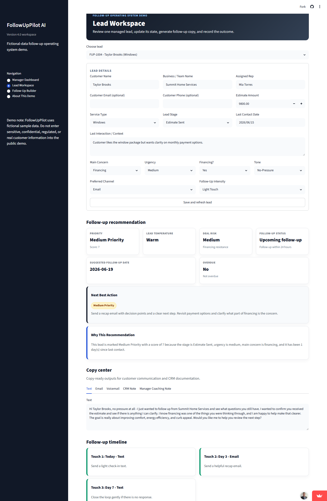
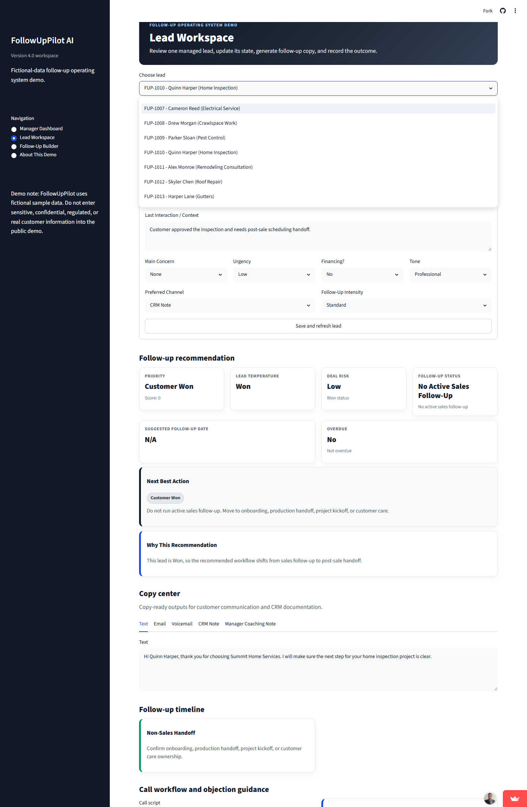
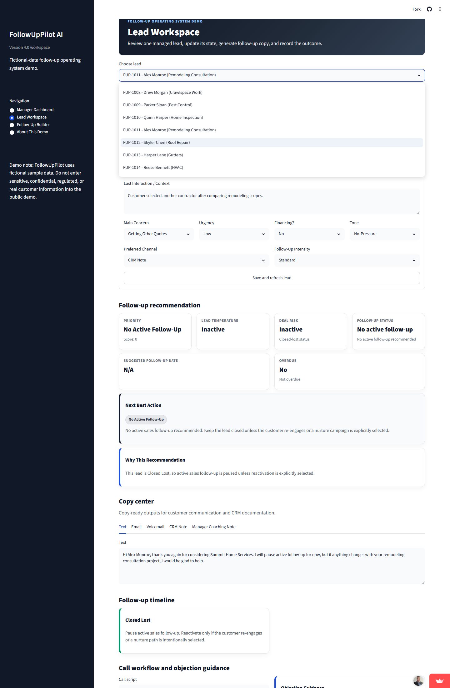
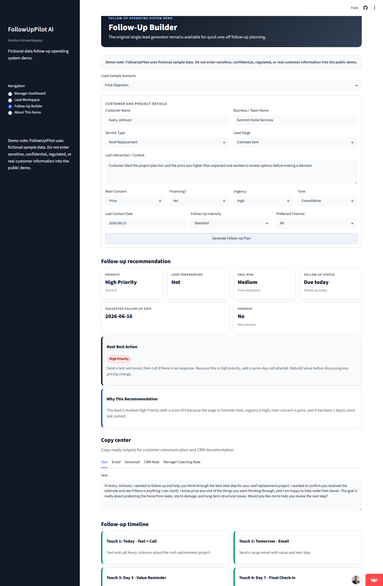
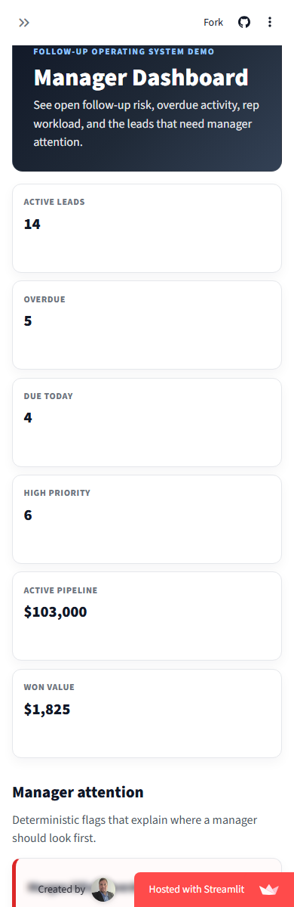

# FollowUpPilot AI

FollowUpPilot AI is a public-safe portfolio demonstration of a lightweight follow-up operating system for home-service and local service businesses.

The demo shows a practical sales workflow:

```text
Manager sees overdue risk -> opens lead -> rep gets next action/copy -> outcome is recorded.
```

It is intentionally scoped as a Streamlit Community Cloud demo. It uses fictional data, session-only persistence, deterministic business rules, optional AI copy polish, CSV import/export, and PDF report downloads.

## Live Demo

[Launch FollowUpPilot AI](https://followuppilot-ai.streamlit.app/)

> **Fictional-data disclaimer:** Do not enter real customer information, payment details, financing records, credentials, regulated data, confidential business records, or secrets into the public demo.

## Product Screenshots

### Manager Dashboard



Managers can see overdue follow-up risk, due-today work, active pipeline value, won value, rep workload, attention flags, and pipeline charts.

### Lead Workspace



Reps and managers can open a lead, review context, refresh the deterministic plan, copy customer-ready communication, download a PDF, and record the follow-up outcome.

### Won and Closed Lost Behavior



Won leads shift away from active sales follow-up and into customer-care or production-handoff language.



Closed Lost leads avoid aggressive active-sales follow-up unless a nurture/reactivation path is intentionally selected.

### Follow-Up Builder



The original single-lead builder remains available for one-off follow-up planning and demonstration scenarios.

### Mobile View



The demo remains usable at a narrow mobile width for quick portfolio review and sales-story walkthroughs.

## What the Demo Does

FollowUpPilot combines manager visibility with rep execution:

- surfaces overdue, due-today, high-priority, and stale follow-up risk
- identifies manager-attention items with transparent explanations
- lets a rep work from one selected lead at a time
- produces an email draft, text-message draft, voicemail, CRM note, call script, manager coaching note, and follow-up sequence
- recommends next action, priority, deal risk, follow-up status, and follow-up date
- records follow-up outcome and recalculates the next recommendation
- supports CSV template download, CSV import/export, and PDF plan download

## Rules-First Design

```text
Rules decide. AI polishes. Guardrails constrain. Fallback protects.
```

The deterministic rules engine is the source of truth for:

- lead-stage behavior
- priority and risk
- follow-up date suggestions
- overdue, due-today, upcoming, Won, and Closed Lost status
- manager attention flags
- next action
- CRM note structure
- follow-up sequence
- PDF/report content

Optional AI enhancement can polish copy-center wording when an OpenAI key is configured. It does not decide lead status, priority, dates, risk, or business outcomes. If no key is present, the app continues with deterministic fallback output.

## Current Demo Scope

Included:

- Streamlit Manager Dashboard
- Streamlit Lead Workspace
- Follow-Up Builder
- fictional demo lead dataset
- session-state lead store
- CSV import/export
- PDF report generation
- deterministic validation and follow-up logic
- optional OpenAI copy enhancement
- automated tests and Ruff linting

Not included by design:

- authentication
- billing
- production database
- scheduled background jobs
- direct CRM integrations
- real email or SMS sending
- real customer data storage
- multi-tenant production controls

## Local Development

```bash
py -m venv .venv
.venv\Scripts\activate
py -m pip install -r requirements.txt
py -m streamlit run app.py
```

## Test and Lint

```bash
py -m pytest -q
py -m ruff check .
py -c "import app; import core.lead_store; import core.dashboard; import core.followup_logic"
```

## AI Configuration

AI enhancement is optional.

Preferred:

```bash
OPENAI_API_KEY=your_api_key_here
```

Legacy compatibility:

```bash
OPENAI_TOKEN=your_api_key_here
```

If both are present, `OPENAI_API_KEY` is used.

## Production Notes

The live app has been verified on Streamlit Community Cloud after Phase 2 and follow-up hotfixes. Verified workflows include:

- Manager Dashboard startup and navigation
- dashboard-to-workspace lead opening
- active -> Won -> Closed Lost -> active lead switching
- PDF download
- CSV template and export download
- Follow-Up Builder deterministic generation
- responsive desktop, tablet, and mobile smoke checks
- graceful deterministic behavior without OpenAI

Known non-blocker: Streamlit/Vega-Lite may emit nonfatal chart warnings in the browser console. These do not block the demo workflow.

## Future Production Path

A production version would need durable storage, authentication, authorization, tenant separation, audit trails, data-retention policy, CRM/email/SMS integration review, monitoring, background jobs, and operational support.
